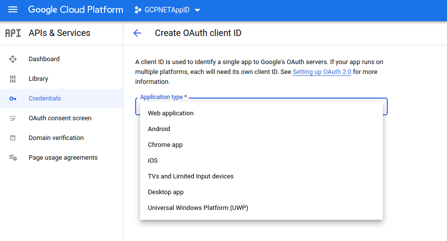
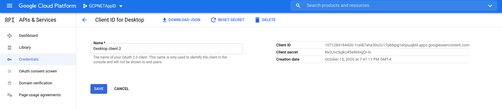

### oauth2oidc

Utility function that exchanges a user `refresh_token` for a Google `OpenID Connect (OIDC)` token with a user-defined audience.

>> This is not an officially supported Google product

Many services like Google Cloud Run, Cloud Functions, apps behind IAP, etc require `OpenID Connect Tokens`. 

An OIDC token that these services receive usually must include an `audience (aud:)` claim that specifies the service name it is intended for.  For example, for a Cloud Run service called `https://foo.bar.run.app` the audience claim must match that value.  For IAP, it must match the `client_id` associated with the IAP protection being enforced (see [Authenticating from a desktop app](https://cloud.google.com/iap/docs/authentication-howto#authenticating_from_a_desktop_app))

Creating and using OIDC token for a Service Account flows (2legged oauth `2LO`) is relatively easy (see appendix).

The story gets more complicated when you want to use a users credential to derive an `id_token` with an arbitrary audience value.  This is because the type of oauth flow a user takes with web consent and login (3legged oauth `3LO`) does not allow for arbitrary audience values and has it fixed to the `client_id` that facilitated it.  (see section `3.1.3.7` of the [specs](https://openid.net/specs/openid-connect-core-1_0.html#CodeIDToken))

---

Cloud run and cloud functions cheated a bit: it whitelisted any `id_token` that happens to use the `aud:` value for the `gcloud` cli.  

See for yourself: 

run `gcloud auth print-identity-token` and decode the jwt at [jwt.io](jwt.io).  Take that token and do as suggested in [Cloud Run Authenticating developers](https://cloud.google.com/run/docs/authenticating/developers)...it works for Cloud Run because accepts `aud: 32555940559.apps.googleusercontent.com` if the underlying user or service account has IAM permissions.

---

#### `What about Bob?`

What about IAP or any other service?  I want to mint an `id_token` for a service where i specify the audience...

Well you can but in a _very limited way_:  On GCP, you can acquire an `id_token` for a user iff the `client_id`/`client_secret` and audience specified is a  `client_id` are within the _same GCP project_. (yeah, pretty specific).

In other words (and probably not clarifying!), you need to run a 3LO with a `client_id/secret` and then exchange the `refresh_token` you acquire through that for yet another token (!) in which you specify an `aud` value which happens to be for a `client_id` thats associated in the same project (whew!)

..right..

You can follow [this](https://cloud.google.com/iap/docs/programmatic-oauth-clients#end_user_authentication) guide which is limited (i.e, gcloud or svc accounts) or  follow in  excruciating details these steps: ([Authenticating from a desktop app](https://cloud.google.com/iap/docs/authentication-howto#authenticating_from_a_desktop_app))


So, lets make this easier and have a small script that does (some) of this

What we're going to do is create a small application that performs 3LO and then acquires an id_token for a given audience

#### Download client_secrets.json

First create `client_secrets.json` in _the same project where IAP runs ...or more generally, where the `client_id` you want the audience value to be

IN the cloud console, goto

`API & Services -> Credentials`  

  - `Create Credentials`  
  - select `OAuth client ID`
  - select `Desktop App`
  - select `Create`
  - select `Download JSON`





### Get the Audience value for IAP

Find the oauth2 `client_id` **FOR** IAP as describe [here](https://cloud.google.com/iap/docs/authentication-howto#authenticating_from_a_service_account)...i know, it talks about service accounts but we will use it anyway!


### Usage

#### as CLI

Then git clone this repo and specify the audience value above as well as the client_id/secrets file you downloaded earlier.

Ignore the creds.json..this will contain the `access_token`, `refresh_token` and cached `id_token`.  Remember to keep this safe!

```bash
cd cmd/
go run main.go --audience=1071284184436-vu96hfaugnm9falak0pl00ur9cuvldl2.apps.googleusercontent.com  \
   --credential_file=creds.json \
   --client_secrets_file=client_secret.json
```

#### as Docker

You can use the Dockerhub binary at `salrashid123/oauth2oidc`:

The following command places the required `client_secret.json` file under a volume mounted at `/creds`

```
docker run -ti  -v `pwd`/creds:/creds:rw salrashid123/oauth2oidc:latest \
  --audience=1071284184436-vu96hfaugnm9falak0pl00ur9cuvldl2.apps.googleusercontent.com \
  --credential_file=/creds/creds.json --client_secrets_file=/creds/client_secret.json
```

#### as Library

```golang
import (
	"github.com/salrashid123/oauth2oidc"
)

flAudience := "1071284184436-vu96hfaugnm9falak0pl00ur9cuvldl2.apps.googleusercontent.com"
client_id := "1071284184436-vplkpq4ntj09kbqjj41b353hm7liuqab.apps.googleusercontent.com"
client_secret := "redacted"
refreshToken :=  "clearlyredacted"
r, err := oauth2oidc.GetIdToken(flAudience, client_id, client_secret, refreshToken)
fmt.Printf("%s",r.IDToken)
```


The output will be the id token you can use against IAP 

eg, the token should show your user id as the `sub` and the target audience you always wanted:

```json
{
  "iss": "https://accounts.google.com",
  "azp": "1071284184436-vplkpq4ntj09kbqjj41b353hm7liuqab.apps.googleusercontent.com",
  "aud": "1071284184436-vu96hfaugnm9falak0pl00ur9cuvldl2.apps.googleusercontent.com",
  "sub": "108157913093274845548",
  "hd": "initech.com",
  "email": "bob@initech.com",
  "email_verified": true,
  "at_hash": "R2KHFlpJcjS1wpMt5O31gg",
  "iat": 1602803086,
  "exp": 1602806686
}
```


#### Appendix

- [Authenticating using Google OpenID Connect Tokens](https://github.com/salrashid123/google_id_token)
- [gRPC Authentication with Google OpenID Connect tokens](https://github.com/salrashid123/grpc_google_id_tokens)
- [Oauth2 Installed Application](https://developers.google.com/identity/protocols/oauth2#installed)
- [OAuth 2.0 for Mobile & Desktop Apps](https://developers.google.com/identity/protocols/oauth2/native-app)


For reference, this is what a sample client_secrets and credentials file looks like

```bash
$ cat client_secret.json | jq '.'
{
  "installed": {
    "client_id": "1071284184436-vplkpq4ntj09kbqjj41b353hm7liuqab.apps.googleusercontent.com",
    "project_id": "mineral-minutia-820",
    "auth_uri": "https://accounts.google.com/o/oauth2/auth",
    "token_uri": "https://oauth2.googleapis.com/token",
    "auth_provider_x509_cert_url": "https://www.googleapis.com/oauth2/v1/certs",
    "client_secret": "eirE9q-redacted",
    "redirect_uris": [
      "urn:ietf:wg:oauth:2.0:oob",
      "http://localhost"
    ]
  }
}
```

```bash
$ cat creds.json | jq '.'
{
  "access_token": "ya29.a0AfH6SM-redacted",
  "token_type": "Bearer",
  "id_token": "eyJhbGciOiJSU-redacted",
  "expires_in": 3599,
  "refresh_token": "1//0dMd-redacted"
}
```


